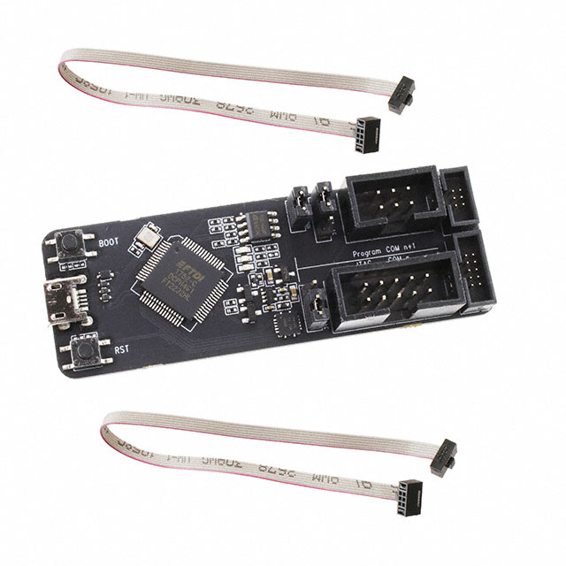

# _BinOwl Td5Gauge firmware_

***If this software helped you or you think it is valuable, I would be grateful for a tip via [PayPal](https://paypal.me/k0sci3j), [donate me](https://www.paypal.com/donate/?hosted_button_id=YASECWP5FR7DL) or support on [Patreon](https://patreon.com/k0sci3j)***
___

The on-board computer is designed to help you diagnose problems with the Td5 engine. An additional advantage is the possibility of continuous monitoring engine parameters while driving. 
Additionally you can set alarm for your coolant temperature. If temperature is too high screen will start to flash to inform you that something is going wrong. 
Whole communication with the sensors in the engine takes place through the OBD2 diagnostic port and ECU. 
There are many parameters that can be viewed:

* Momentary fuel consumption.
* Fuel consumption from engine start.
* Drivers wish.
* Idle fuel injection.
* Total fuel injected.
* Current speed – Value can be increased up to 30%.
* Fuel temperature.
* Intake manifold temperature.
* Coolant temperature.
* Engine RPM.
* ECU voltage.
* MAF Sensor data.
* MAP pressure + RAW data.
* AAP pressure. + RAW data.
* Turbo boost.
* Wastegate PWM modulation.
* Injectors balance.
* Throttle potentiometer voltage.

You can also monitor these parameters with your smartphone or laptop or computer or watch or whatever has WiFi and browser :)

This is firmware used in BinOwl devices based on ESP32. You can compile it and use it with your device. Please note, that this will not work on Atmega based devices (without WiFi).

You do not know how to upload firmware to your BinOwl device? [Here is instruction](manual_case_WiFi_EN.pdf).

**I'm not responsible for hardware damage resulting from self-installation of the software. Both your on-board computer and your ECU** 
**Please note that your firmware in your existing device is signed and it is your responsibility to compile firmware for it properly** 

## How to compile it
### Setup
Setup your working environment according to [ESP-IDF Documentation](https://docs.espressif.com/projects/esp-idf/en/v4.4.5/esp32/get-started/index.html). I strongly suggest to use **Ubuntu 20.04**.
1. Install prerequisites for your OS (i.e.: [Linux](https://docs.espressif.com/projects/esp-idf/en/v4.4.5/esp32/get-started/linux-setup.html))
2. [Get ESP-IDF](https://docs.espressif.com/projects/esp-idf/en/v4.4.5/esp32/get-started/index.html#get-started-get-esp-idf)
3. [Setup ESP-IDF](https://docs.espressif.com/projects/esp-idf/en/v4.4.5/esp32/get-started/index.html#step-3-set-up-the-tools)
4. After installation you can export needed env settings with: 

            . ./export.sh

5. Install cmake:

            idf_tools.py install cmake

### Build
*Please note:* Bootloader is capable to boot newer version of firmware than botloader, but it is not able to boot older version. See [this guide](https://docs.espressif.com/projects/esp-idf/en/v4.4.5/esp32/api-guides/bootloader.html) on ESP-IDF page. Bootloader installed on BinOwl devices was build with esp toolset v4.4, so any newer firmware build version >=v4.4 should be upgradable via OTA without any problems. Original BinOwl Td5Gauge device is build with ESP32-PICO-V3, so all commands in this manual are for this MCU.
1. Build project:

        idf.py build

2. New firmware location:
    * Bootloader (You do not need it if you are trying to create your own firmware for BinOwl Td5Gauge):

                build/bootloader/bootloader.bin

    * Firmware (This is your main firmware - You cannot OTA it yet, but it will be needed in next steps):

                build/Td5Gauge_firmware.bin

    * Partition Table:

                build/partition-table/partition-table.bin

    * OTA Initial data:
        
                build/ota_data_initial.bin

### OTA preparation
Firmware encryption for OTA

        ./obfuscate.py -i ../build/Td5Gauge_firmware.bin -o Td5Gauge_firmware_obfuscated.bin

Only encrypted OTA image will be accepted by OTA update process on device. *Note:* This encrypted firmware is **ONLY** for OTA update. If you want to upload firmware with programming device you need to use unencrypted firmware.

## How to flash it
### Flashing device
I'm using original ESP-PROG Flash/JTAG device, but you can use any compatible ESP32 flashing device. Of course you do not need flashing device to flash new firmware via OTA. Programming device is needed only for first time upload on blank ESP32 or for debug purposes.

### Flashing process
*Note: Check your programming device port*
1. Erase flash on ESP32:

        esptool.py --port=/dev/ttyUSB1 erase_flash

2. Bootloader programming:

        esptool.py --chip esp32 --port=/dev/ttyUSB1 --before=default_reset --after=no_reset write_flash --flash_mode dio --flash_freq 20m --flash_size 4MB 0x1000 build/firmware/bootloader.bin

3. Firmware programming:

        esptool.py -p /dev/ttyUSB1 -b 460800 --before default_reset --after no_reset --chip esp32  write_flash --flash_mode dio --flash_size detect --flash_freq 20m 0x10000 build/partition-table/partition-table.bin 0x16000 build/ota_data_initial.bin 0x20000 build/Td5Gauge_firmware.bin

4. Restart and stay in monitor after programming:

        idf.py -p /dev/ttyUSB1 monitor
   
   On this step you need to observe ESP32 monitor as device will start to encrypt partitions. Do not plug off it on this step. You can safely unplug device after partition encryption process ends and ESP32 restarts.
